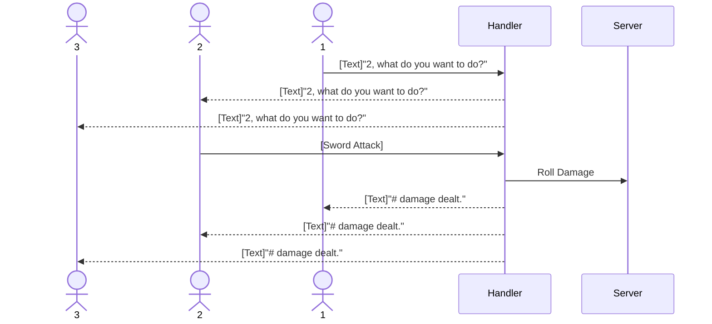

# Digital Dragons

[My Notes](notes.md)

A simple role-playing game for one or more players.

> [!NOTE]
> This is a template for your startup application. You must modify this `README.md` file for each phase of your development. You only need to fill in the section for each deliverable when that deliverable is submitted in Canvas. Without completing the section for a deliverable, the TA will not know what to look for when grading your submission. Feel free to add additional information to each deliverable description, but make sure you at least have the list of rubric items and a description of what you did for each item.

> [!NOTE]
> If you are not familiar with Markdown then you should review the [documentation](https://docs.github.com/en/get-started/writing-on-github/getting-started-with-writing-and-formatting-on-github/basic-writing-and-formatting-syntax) before continuing.

## 🚀 Specification Deliverable

> [!NOTE]
> Fill in this sections as the submission artifact for this deliverable. You can refer to this [example](https://github.com/webprogramming260/startup-example/blob/main/README.md) for inspiration.

For this deliverable I did the following. I checked the box `[x]` and added a description for things I completed.

- [X] Proper use of Markdown
- [X] A concise and compelling elevator pitch
- [X] Description of key features
- [X] Description of how you will use each technology
- [X] One or more rough sketches of your application. Images must be embedded in this file using Markdown image references.

### Elevator pitch

*Digital Dragons* is a simple game for one or more players. It is meant to be able to help the players collaboratively tell a story together similar to popular Tabletop Role-Playing Games such as *Dungeons & Dragons*. It will keep track of and share player information including character state and anything the players do. It will also share information on the game and story when neccesary through maps, images, and text descriptions. 

### Design

Following is a sequence diagram showing how Players interact with the game and eachother.

### Key features

- Ability to make and join a game
- Ability to Name and make some character build choices
- Enables text based communication between players
- Keeps track of damage dealt to and by the player characters
- Constantly displays Player Health and resources
- Saves game and player roles for future sessions

### Technologies

I am going to use the required technologies in the following ways.

- **HTML** - Uses correct HTML structure for application for four HTML pages. One for login, one for Joining/Creating a game, one for creating a character, and another for playing the game
- **CSS** - Implementation of styling that works on different screen sizes and uses good color and contrast.
- **React** - Provides the interactive portions of the game interface including joining/making the game, action selection, and communication. It will also display shared elements such as health, maps, and story descriptions. It will update these elements as choices are made.
- **Service** - Backend service with endpoints for:
  - Making and Joining games.
  - Creating and collecting character information.
  - Retriving current game data such as health, maps, and story text.
  - Submitting player actions and text messages.
  - Handling player actions including text messages and attack actions.
  - Register, login, and logout users.
- **DB/Login** - Store authentication information, and user accounts. Keeps game information including player characters, health, and recent story events.
- **WebSocket** - As each player performs an action that action is displayed to all other players in that game.

## 🚀 AWS deliverable

For this deliverable I did the following. I checked the box `[x]` and added a description for things I completed.

- [X] **Server deployed and accessible with custom domain name** - [Digital Dragons](https://startup.digitaldragons.click/).

## 🚀 HTML deliverable

For this deliverable I did the following. I checked the box `[x]` and added a description for things I completed.

- [X] **HTML pages** - I made 4 HTML pages for login, game creation, character creation, & gameplay.
- [X] **Proper HTML element usage** - I used HTML elements throughout the pages including: header, nav, main, section, footer, form, & ul
- [X] **Links** - All pages are linked through a navigation menu at the top of each page.
- [X] **Text** - All pages include text description for things like logging in, character creation elements, & gameplay instructions.
- [X] **3rd party API placeholder** - There is a placeholder for a dice roller service in game.html.
- [X] **Images** - game.html has an example image for a map.
- [X] **Login placeholder** - index.html allows players to enter a username and password and has options for using an existing account or making a new one.
- [X] **DB data placeholder** - character.html has a projected character section saying that the game will store the character elements including name and stats.
- [X] **WebSocket placeholder** - The game page includes a Party Actions log to show realtime communication.

## 🚀 CSS deliverable

For this deliverable I did the following. I checked the box `[x]` and added a description for things I completed.

- [X] **Visually appealing colors and layout. No overflowing elements.** - main.css is mostly controlling my colors and bootstrap is used for layour.
- [X] **Use of a CSS framework** - I included bootstrap and used it throughout my html files.
- [X] **All visual elements styled using CSS** - I styled my pages with css.
- [X] **Responsive to window resizing using flexbox and/or grid display** - I tested this by increasing and decreasing my window size and the elements shift properly to look good on several sizes.
- [X] **Use of a imported font** - I imported Sacramento and used it in my header.
- [X] **Use of different types of selectors including element, class, ID, and pseudo selectors** - I used several of these selectors.

## 🚀 React part 1: Routing deliverable

For this deliverable I did the following. I checked the box `[x]` and added a description for things I completed.

- [X] **Bundled using Vite** - I installed and used Vite and can run the app with npm run dev.
- [X] **Components** - I have 4 components; login, startgame, character, and the game. All of which now use jsx files.
- [X] **Router** - My React Router is set up to navigate between the /login, /startgame, /character, and /game pages, with a 404 fallback for unknown routes.

## 🚀 React part 2: Reactivity deliverable

For this deliverable I did the following. I checked the box `[x]` and added a description for things I completed.

- [ ] **All functionality implemented or mocked out** - I did not complete this part of the deliverable.
- [ ] **Hooks** - I did not complete this part of the deliverable.

## 🚀 Service deliverable

For this deliverable I did the following. I checked the box `[x]` and added a description for things I completed.

- [ ] **Node.js/Express HTTP service** - I did not complete this part of the deliverable.
- [ ] **Static middleware for frontend** - I did not complete this part of the deliverable.
- [ ] **Calls to third party endpoints** - I did not complete this part of the deliverable.
- [ ] **Backend service endpoints** - I did not complete this part of the deliverable.
- [ ] **Frontend calls service endpoints** - I did not complete this part of the deliverable.
- [ ] **Supports registration, login, logout, and restricted endpoint** - I did not complete this part of the deliverable.

## 🚀 DB deliverable

For this deliverable I did the following. I checked the box `[x]` and added a description for things I completed.

- [ ] **Stores data in MongoDB** - I did not complete this part of the deliverable.
- [ ] **Stores credentials in MongoDB** - I did not complete this part of the deliverable.

## 🚀 WebSocket deliverable

For this deliverable I did the following. I checked the box `[x]` and added a description for things I completed.

- [ ] **Backend listens for WebSocket connection** - I did not complete this part of the deliverable.
- [ ] **Frontend makes WebSocket connection** - I did not complete this part of the deliverable.
- [ ] **Data sent over WebSocket connection** - I did not complete this part of the deliverable.
- [ ] **WebSocket data displayed** - I did not complete this part of the deliverable.
- [ ] **Application is fully functional** - I did not complete this part of the deliverable.
